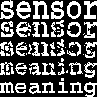
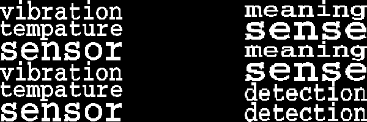
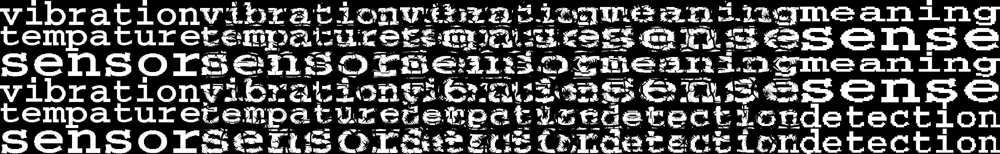
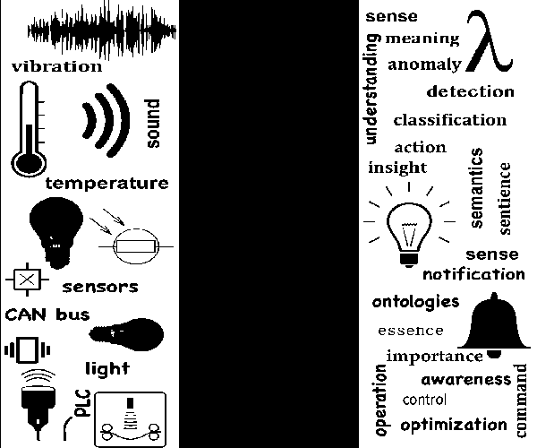

I'm calling these [Parquet deformations](https://www.theguardian.com/artanddesign/alexs-adventures-in-numberland/2014/sep/09/crazy-paving-the-twisted-world-of-parquet-deformations#:~:text=In%20the%201960s%20an%20American,the%20regularity%20of%20the%20tiling.) but purest would lynch me. 

Really, I just wanted to transform one word into another word, gradually, as I've seen in some of [Escher's](https://en.wikipedia.org/wiki/M._C._Escher) work, so I looked it up, and saw that it's called parquet deformations. The math looked enticing, but I had no time for that, so I did the first way I could think of: Mapping pixels to pixels (in some fashion -- but nearest neighbors is the method that yields nicest results, under the pixel-level restriction). 

Of course, this can be applied to any image (that will be transformed to B/W (not even gray -- I mean actual B/W), and there's several ways you can perform the parquet (I like the gif rendering). 

The main function (exposed as a script) is `mk_deformation_image`. All you need is to specify two images (or words). If you want, of course, you can specify:
- `n_steps`: Number of steps from start to end image
- `save_to_file`: path to file to save too (if not given, will just return the image object)
- `kind`: 'gif', 'horizontal_stack', or 'vertical_stack'
- `coordinate_mapping_maker`: A function that will return the mapping between start and end. 
This function should return a pair (`from_coord`, `to_coord`) of aligned matrices whose 2 columns are the the 
`(x, y)` coordinates, and the rows represent aligned positions that should be mapped. 


# Examples

## Two words...


```python
fit_to_size = 400
start_im = image_of_text('sensor').rotate(90, expand=1)
end_im = image_of_text('meaning').rotate(90, expand=1)
start_and_end_image(start_im, end_im)
```


```python
im = mk_deformation_image(start_im, end_im, 15, kind='h').resize((500,200))
im
```


```python
im = mk_deformation_image(start_im.transpose(4), end_im.transpose(4), 5, kind='v').resize((200,200))
im
```





```python
f = 'sensor_meaning_knn.gif'
mk_deformation_image(start_im.transpose(4), end_im.transpose(4), n_steps=20, save_to_file=f)
display_gif(f)
```


```python
f = 'sensor_meaning_scan.gif'
mk_deformation_image(start_im.transpose(4), end_im.transpose(4), n_steps=20, save_to_file=f, 
                     coordinate_mapping_maker='scan')
display_gif(f)
```


```python
f = 'sensor_meaning_random.gif'
mk_deformation_image(start_im.transpose(4), end_im.transpose(4), n_steps=20, save_to_file=f, 
                     coordinate_mapping_maker='random')
display_gif(f)
```


## From a list of words


```python
start_words = ['sensor', 'vibration', 'tempature']
end_words = ['sense', 'meaning', 'detection']
start_im, end_im = make_start_and_end_images_with_words(
    start_words, end_words, perm=True, repeat=2, size=150)
start_and_end_image(start_im, end_im).resize((600, 200))
```





```python
im = mk_deformation_image(start_im, end_im, 5)
im
```





```python
f = 'bunch_of_words.gif'
mk_deformation_image(start_im, end_im, n_steps=20, save_to_file=f)
display_gif(f)
```


## From files


```python
start_im = Image.open('sensor_strip_01.png')
end_im = Image.open('sense_strip_01.png')
start_and_end_image(start_im.resize((200, 500)), end_im.resize((200, 500)))
```





```python
im = mk_deformation_image(start_im, end_im, 7)
im
```


```python
f = 'medley.gif'
mk_deformation_image(start_im, end_im, n_steps=20, save_to_file=f)
display_gif(f)
```


```python
mk_deformation_image(start_im, end_im, n_steps=20, save_to_file=f, coordinate_mapping_maker='scan')
display_gif(f)
```


# an image and some text


```python
start_im = 'img/waveform_01.png'  # will first look for a file, and if not consider as text
end_im = 'makes sense'

mk_gif_of_deformations(start_im, end_im, n_steps=20, 
                               save_to_file='image_and_text.gif')
display_gif('image_and_text.gif')  
```


